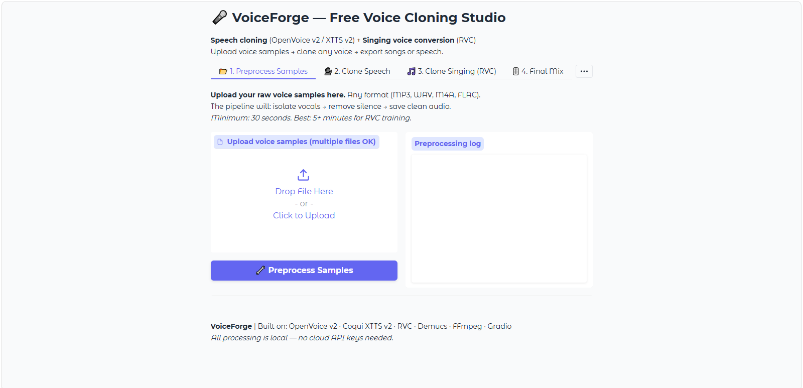
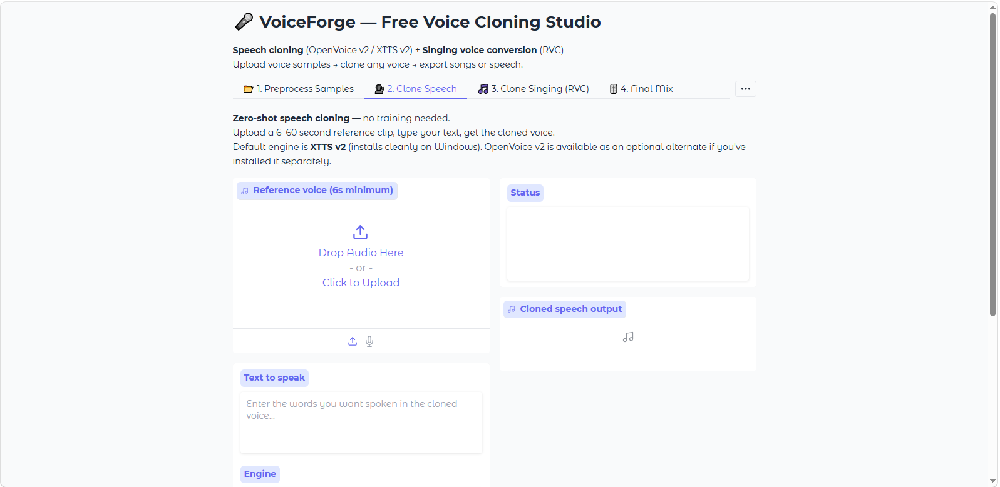
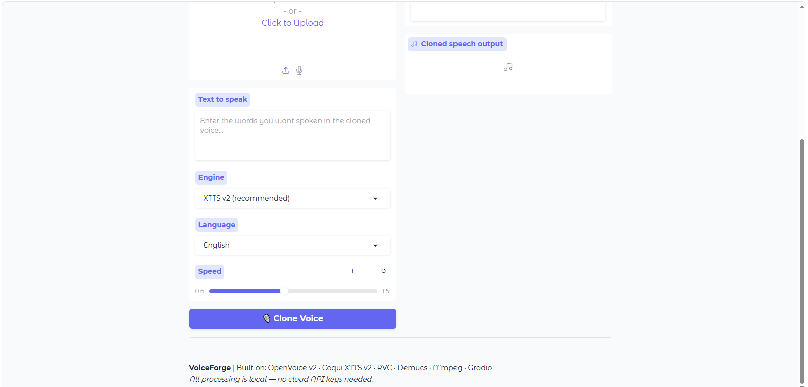
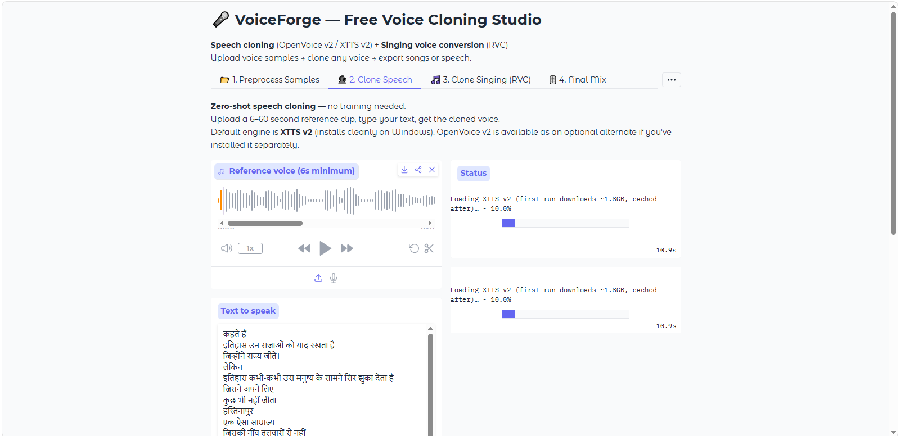

# 🎤 VoiceForge — Free Voice Cloning Studio

Clone any voice for **speech** and **singing** using 100% free, local tools.
No API keys. No subscriptions. Runs on CPU (or Colab GPU for training).

---

---

---

---

---
## 🔊 Voice Demo 

🎧 **Listen to the demo (eg. Piyush Mishra Voice clone):** [voice-demo.mp3](./images/voice-demo.mp3)

---
## What it does

| Feature | Engine | Hardware |
|---|---|---|
| Speech / TTS cloning | **XTTS v2** (primary) · OpenVoice v2 (optional) | CPU (slower) or GPU |
| Singing voice conversion | RVC v2 | CPU inference, GPU training |
| Vocal isolation | Demucs | CPU |
| Final mix (vocals + beat) | FFmpeg | CPU |

> **Why XTTS v2 and not OpenVoice as the main engine?**
> OpenVoice v2's dependency chain (`fairseq`, `unidic`, etc.) frequently fails
> to build on Windows without a full C++ build toolchain. XTTS v2 (Coqui TTS)
> ships clean prebuilt wheels for Windows + Python 3.10/3.11 and does
> zero-shot voice cloning natively. OpenVoice is still available as an
> optional secondary engine in Tab 2 if you install it separately.

---

## Quick start

### 1. Install system dependencies

```bash
# Linux
sudo apt install ffmpeg python3-pip

# macOS
brew install ffmpeg

# Windows
# Download a build from https://www.gyan.dev/ffmpeg/builds/
# Extract it, then add the bin/ folder to your PATH, restart your terminal.
```

### 2. Install Python packages

```bash
cd VoiceForge
python setup.py
```

This installs Gradio, PyTorch (CPU build), **XTTS v2** (primary speech engine),
RVC, and Demucs — each package installs independently, so if one fails the
rest still install.

To verify what's installed without installing anything:
```bash
python setup.py --check
```

To also attempt the optional OpenVoice v2 engine:
```bash
python setup.py --enable-openvoice
```

### 3. Launch the app

```bash
python app.py
# Opens at http://localhost:7860
```

---

## Usage workflow

### For speech cloning (no training needed)

1. **Tab 1 — Preprocess**: Upload 30s–5min of the target voice audio
2. **Tab 2 — Clone Speech**: Select the cleaned sample → choose engine
   (XTTS v2 is selected by default) → type your text → clone

### For singing voice cloning

**Step A — One-time local setup (sets up the inference engine)**

```bash
python setup.py --rvc-only
```
This requires **git** ([download here](https://git-scm.com/downloads)) and
clones the official RVC WebUI repo into `rvc_webui/`, with its own pinned
dependencies. This is the engine Tab 3 calls into — do this once before
your first conversion.

**Step B — Train a voice model on Colab (one time per voice)**

1. Open `colab_rvc_training.ipynb` in Google Colab
2. Enable T4 GPU runtime (Runtime → Change runtime type)
3. Run all cells — upload your cleaned samples when prompted
4. Download `voice_name.pth` + `voice_name.index` from Google Drive

**Step C — Run locally**

1. Put `.pth` and `.index` files in `rvc_models/`
2. **Tab 3 — Clone Singing**: upload acapella/melody → select model → convert
3. **Tab 4 — Final Mix**: add your beat/instrumental → export

---

## Voice sample tips

| Duration | Quality | Best for |
|---|---|---|
| 6–30 sec | Low | Quick demo, XTTS test |
| 1–5 min | Good | OpenVoice zero-shot |
| 5–30 min | Great | RVC training |
| 30min+ | Excellent | Professional RVC model |

**Sample quality checklist:**
- ✅ Clean, no background music
- ✅ Minimal reverb / echo
- ✅ Consistent microphone
- ✅ Full sentences (not just words)
- ✅ Range of emotions/tones if possible
- ❌ Avoid phone recordings if possible
- ❌ No crowd noise, wind, or compression artifacts

---

## RVC training settings guide

```
Epochs:       100  → fast, decent
              150  → recommended for 5min samples  
              200  → best quality, 30-40min on Colab T4
              300+ → diminishing returns unless 15min+ audio

Batch size:   8    → Colab T4 default
              12   → if you have A100 / more VRAM

Pitch algorithm:
  rmvpe      → best overall (recommended)
  harvest    → older, slightly slower
  crepe      → good for singing
```

---

## Inference settings (Tab 3)

| Setting | Value | Effect |
|---|---|---|
| Pitch shift | 0 | Keep original key |
| Pitch shift | +2 to +6 | Male → Female voice range |
| Pitch shift | -2 to -6 | Female → Male voice range |
| Index rate | 0.75 | Recommended — faithful to trained voice |
| Index rate | 0.4–0.6 | More natural, less robotic |
| Protect | 0.33 | Recommended — prevents consonant distortion |

---

## File structure

```
VoiceForge/
├── app.py                      ← Main Gradio app (launch this)
├── setup.py                    ← Install script
├── requirements.txt
├── colab_rvc_training.ipynb    ← Colab notebook for RVC training
│
├── samples/                    ← Your uploaded + cleaned audio files
│   ├── voice_raw.wav
│   ├── voice_vocals.wav        ← After Demucs
│   └── voice_clean.wav         ← Final preprocessed file
│
├── rvc_models/                 ← Drop trained RVC models here
│   ├── artist_voice.pth
│   └── artist_voice.index
│
├── checkpoints/                ← OpenVoice v2 model weights
│   ├── converter/
│   │   ├── config.json
│   │   └── checkpoint.pth
│   └── base_speakers/ses/
│       └── en-default.pth
│
└── output/                     ← All generated audio files
    ├── speech_1234567890.wav
    ├── rvc_artist_1234567890.wav
    └── final_mix_1234567890.wav
```

---

## Free tools used

| Tool | Purpose | License |
|---|---|---|
| [OpenVoice v2](https://github.com/myshell-ai/OpenVoice) | Zero-shot speech cloning | MIT |
| [Coqui XTTS v2](https://github.com/coqui-ai/TTS) | TTS + cloning fallback | MPL-2.0 |
| [RVC](https://github.com/RVC-Project/Retrieval-based-Voice-Conversion-WebUI) | Singing voice conversion | MIT |
| [Demucs](https://github.com/facebookresearch/demucs) | Vocal isolation | MIT |
| [Gradio](https://gradio.app) | Web UI | Apache-2.0 |
| [FFmpeg](https://ffmpeg.org) | Audio processing + mixing | LGPL |

---

## Common errors

**"Coqui TTS not installed" / clone fails on speech tab**
```bash
pip install coqui-tts
```
**Do NOT run `pip install TTS`** — that package name is unmaintained and
requires a C++ compiler to build on Windows, which is exactly the error you
may have hit before. `coqui-tts` is the actively maintained fork with
prebuilt wheels for Windows/macOS/Linux. The import path is unchanged
(`from TTS.api import TTS`), so no code changes are needed either way.

**"openvoice-cli / melo-tts not installed (this is optional)"**
This is expected and fine — XTTS v2 handles speech cloning by default.
Only install this if you specifically want the OpenVoice engine:
```bash
python setup.py --enable-openvoice
```

**"RVC WebUI not found" on the singing tab**
```bash
python setup.py --rvc-only
```
This requires **git** to be installed (https://git-scm.com/downloads).
It clones the official RVC WebUI repo and installs its own pinned
requirements — this avoids the broken `rvc-python` PyPI package, which has
a permanent dependency conflict (fairseq pins an old omegaconf release with
invalid PyYAML metadata that modern pip refuses to resolve).

**"FFmpeg not found"**
```bash
sudo apt install ffmpeg   # Linux
brew install ffmpeg       # macOS
```
Windows: download from https://www.gyan.dev/ffmpeg/builds/, extract, and
add the `bin/` folder to your PATH, then restart your terminal/IDE.

**XTTS first run is slow (downloading ~1.8GB)**
This is normal — the model downloads once on first use and caches locally
in your user profile (e.g. `~/.local/share/tts` or `%LOCALAPPDATA%\tts` on Windows).

**Out of memory on CPU**
XTTS v2 is heavy on RAM. Close other applications.
On CPU, synthesis takes roughly 30–120 seconds per sentence — this is expected,
not a bug.

---
